# Hello world

This tutorial will show you the basics of Forest. We're going to write the following obligatory program:

```typescript
console.log("Hello world");
```

The learning curve for this is actually pretty steep, but I'm sure you'll manage.

To start, [open up Forest](https://forest.walr.is). You should see two grey rectangles like this:

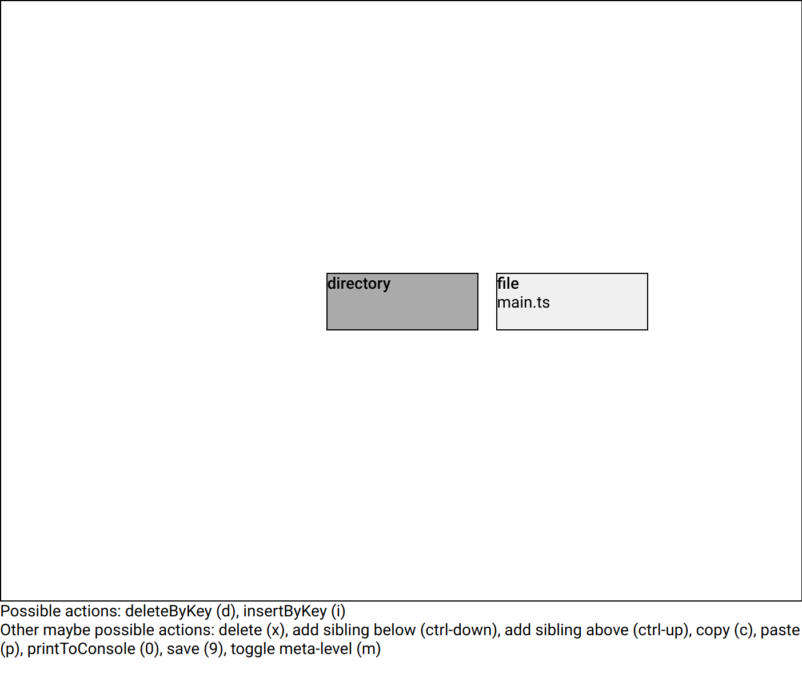

This is the tree for our TypeScript project. There's a directory at the root, which contains one empty file (`main.ts`). Try using the arrow keys to navigate between these two _nodes_ in the tree. The node which is darker grey and right at the center of the view is the _focused node_. Focus the `main.ts` file node. Your view should now look like this:

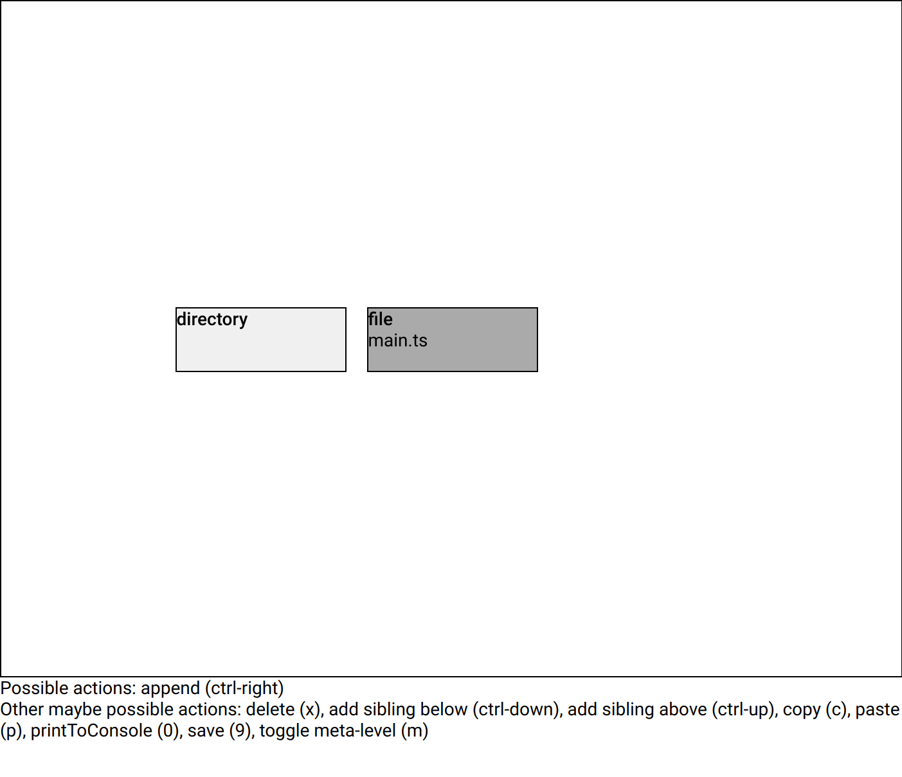

Depending on what node you have focused, there are different _actions_ which you can use. They are listed at the bottom of the screen. Since our file is empty, we need to add something to it. Press `ctrl + right arrow` to add a child to the file. You should see this:

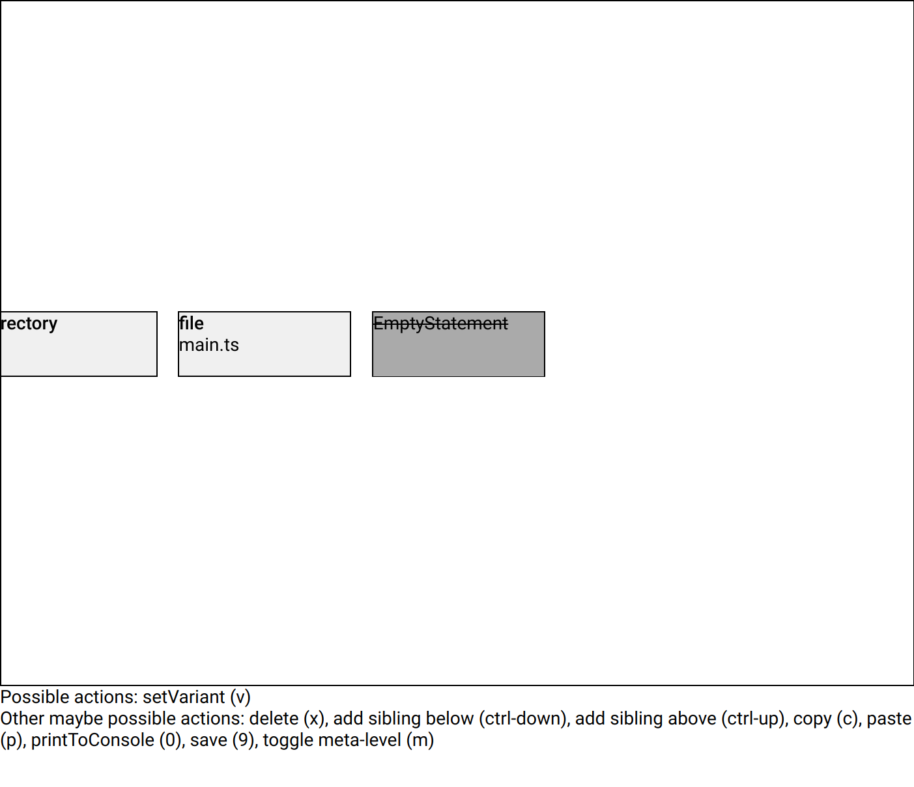

Forest has added a node labeled `EmptyStatement`. This is the typescript AST term for a `;` on an empty line by itself. This is a pretty random default (sadly like all other defaults in Forest), but it is a valid thing to write in a file. We don't need an `EmptyStatement`, but instead could use something like a function call. Press `v` (`setVariant`) to replace the focused node with something else. You'll see this message:

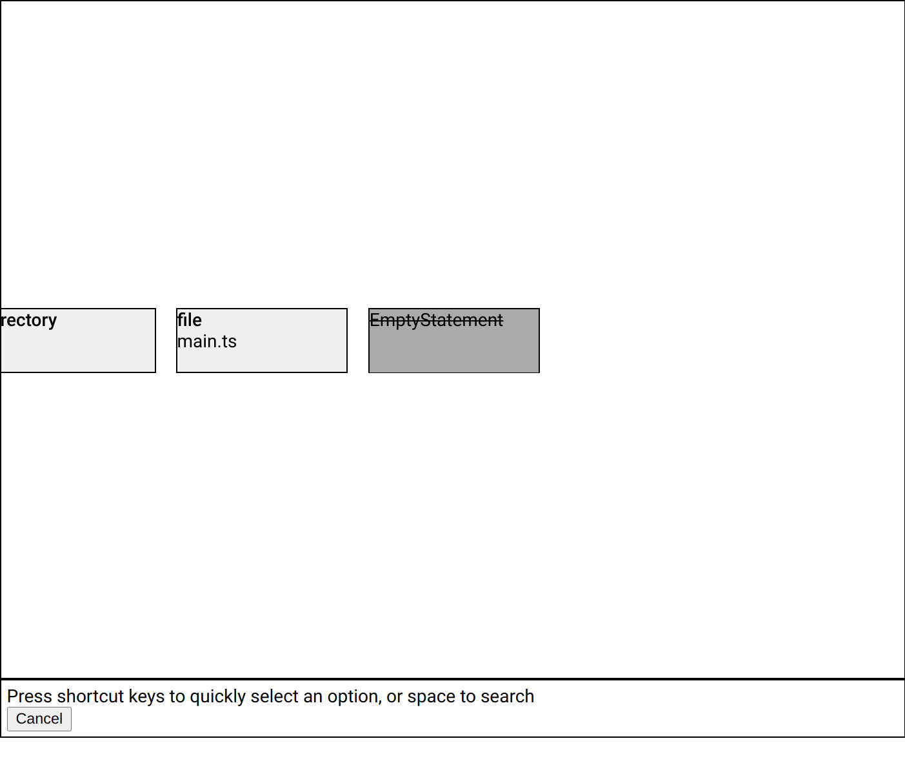

Since you don't know the shortcut for a function call yet, press `space`. That will show you a full list of stuff that you can replace the focused node with. Take a look through that list. There will be some things you recognize, but nothing like a function call. That's because the things that you can write at the top level of a file are _statements_, and a function call is an _expression_ in TypeScript ([What's the difference?](https://stackoverflow.com/questions/12703214/javascript-difference-between-a-statement-and-an-expression)). We need to wrap our function call in an `ExpressionStatement`. That let's you write an expression anywhere where you can write a statement. Pick `ExpressionStatement` from the list and press `enter`. You should now see this:

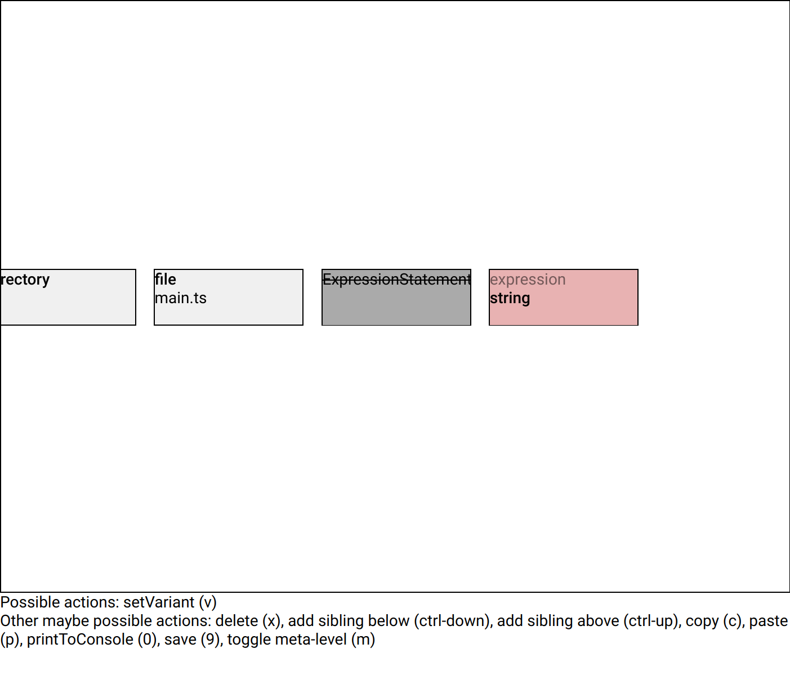

The `EmptyStatement` is gone and there's an `ExpressionStatement` in it's place. It has one child (`expression`), which starts out with another random default (a string literal).

This has all been pretty abstract so far, so let's take a look at our actual program as normal text. Open your browser's [JavaScript console](https://balsamiq.com/support/faqs/browserconsole/) and press `0` (zero) in Forest. That will print your whole program to the console:

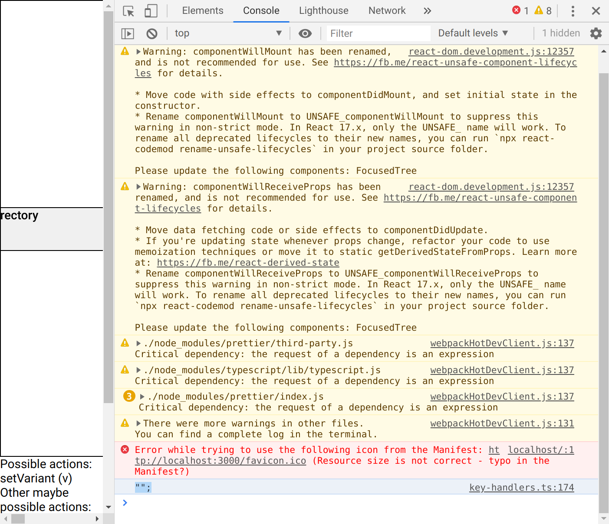

Currently that's just `"";` - a line with a useless empty string on it. Don't worry, we'll get to "Hello world" soon. Focus the string literal node (the red one) and use `v` to open the `setVariant` menu. After pressing space you'll see a different list of choices here, including the one we're looking for - a `CallExpression`:

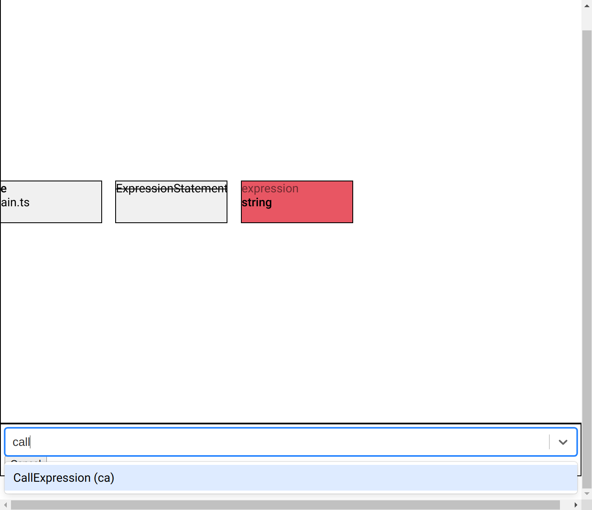

Choose that option with `enter`. Our string literal has now been replaced by a function call, but we still need to define what we're going to call (`console.log`) and what arguments to pass (`"Hello world"`). Let's start with the arguments. That's not the way you would usually do it, but it's a little easier to explain. Focus the `arguments` node using your arrow keys:

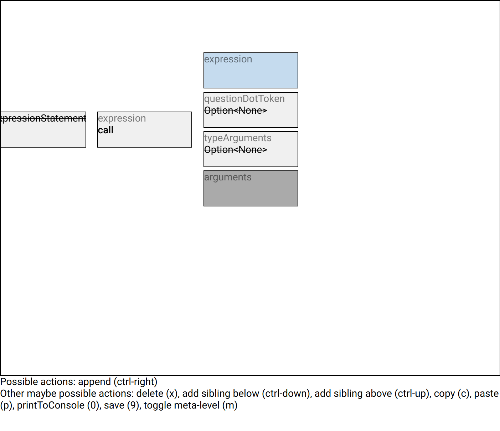

Remember how we added that first statement to our file? Adding an argument to a function call works exactly the same way. Press `ctrl-right` to add an argument. The default here is a string, which is actually what we need. Focus the string (it's probably already focused) and take a look at the "Possible actions" list:

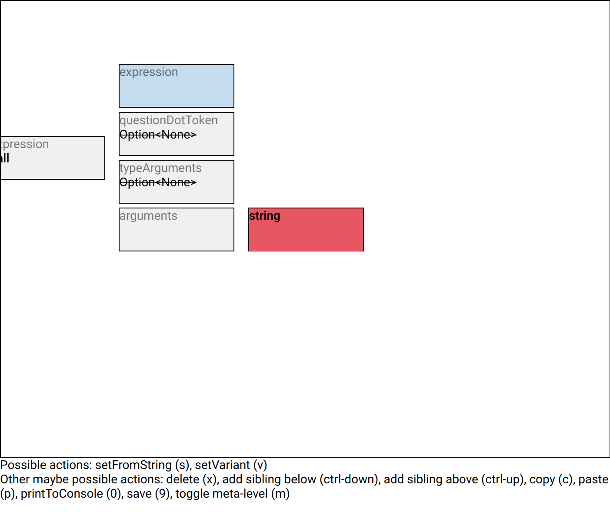

There's a new one here - `setFromString`. This is used to set text-like values (names of functions, string contents, numbers, etc.). Press `s` to use `setFromString`:

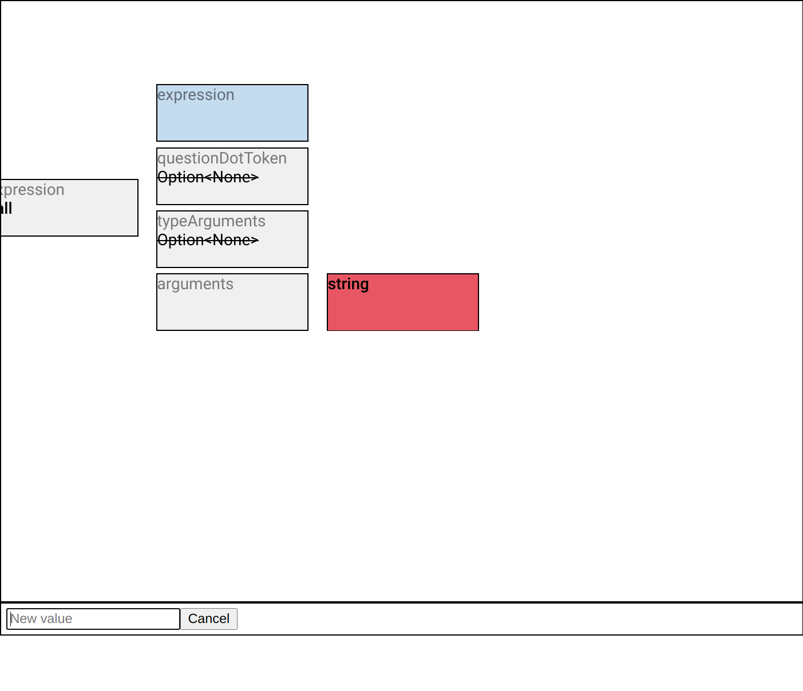

Type `Hello world` in the `New value` input and press `enter`. A special thing about this way of writing strings is that you never need to use escapes. Any text you enter will be automatically escaped in the final program.

Now we have our argument, but we still need to say what function we're calling (`console.log`). Focus the `expression` child of the `call` node (it's probably blue). Take a look at the "Possible actions" list. We have both `setFromString` and `setVariant`. We actually have to use `setVariant`, since we can't write `console.log` with `setFromString`. The reason why will became clear in a bit. Use `setVariant` and choose a `PropertyAccessExpression` (`v`, `space`, search, `enter`). You should have this now:


It's probably pretty confusing what that is, so press `0` and take a look at the text program in your console:

```typescript
({}.("Hello world"));
```

This code takes an object literal, accesses a property of it ("", no name) and calls that as a function. This program is not valid in text form, and only sort of valid as an AST. That's a pretty bad default for a property access, but that's just how things are. Hopefully that gives you a bit more understanding of the tree though.

Let's make this into a valid `console.log`. Focus the object literal (grey rectangle with `object` in it) and open the `setVariant` menu. We want to turn this node into `console`. That's an _identifier_ (a reference to a variable, more or less). Pick `Identifier` from the list and press `enter`. You'll get this blue rectangle:


Forest colors identifiers in blue and literals (string, number, boolean) in red.

Just like you did with the "Hello world" sting literal, use `s` (`setFromString`) to fill out this identifier node. Enter the variable name `console` as the `New value`.

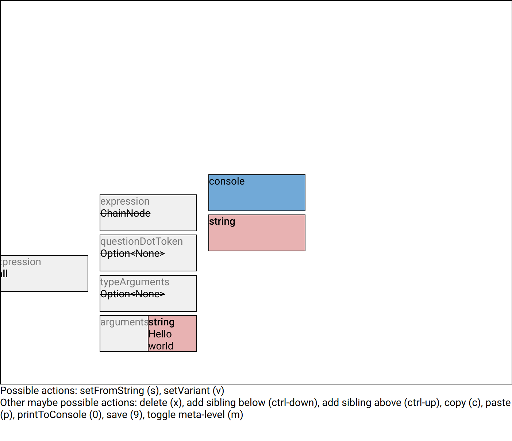

We're almost done. Focus the empty `string`. That's the name of the property we're going to access. Set it to `log` using `s` (`setFromString`).

Press `0` to see `console.log("Hello world");` in your console in all its glory.
